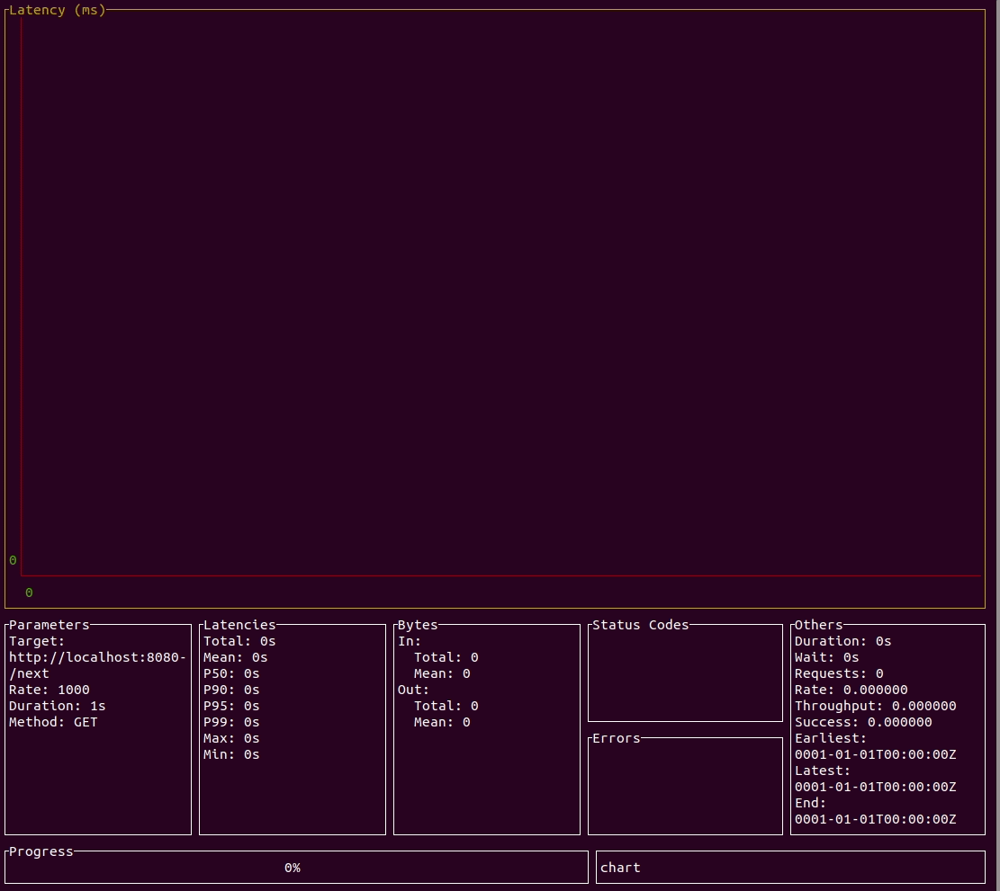
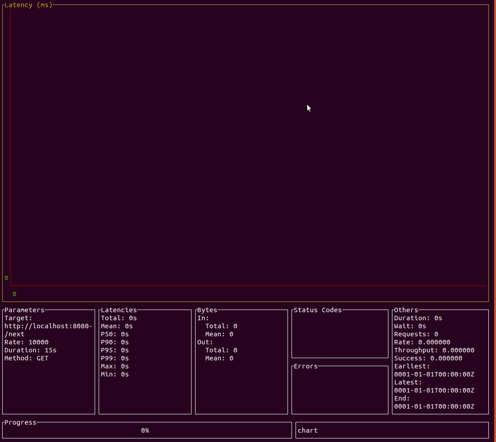
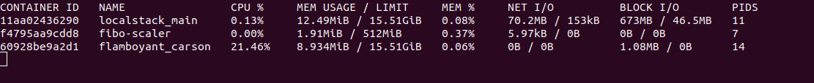

# Fibo-Scaler

## What's the Fibo-Scaler?

Is a simple project to calculate the [fibonacci sequence](https://en.wikipedia.org/wiki/Fibonacci_number) using the `stdblib` to make the http server and test the loads that it can take.

## Table of Contents

- [How it works?](#how-it-works)
- [Load testing](#load-testing)
  - [Test cases](#test-cases)
- [Requirements](#requirements)
- [Running the project](#running-the-project)
  - [Locally](#locally)
  - [Dockerized](#dockerized)
  - [Make](#make)

## How it works?

There are 5 endpoints in the project HTTP API:

- `/` - The root endpoint is intented to be used as a health check of the application.

- `/current` - Gives the current fibonacci sequence number. By default the application starts with current **1**.

- `/previous` - Gives the previous fibonacci sequence number. By default the application starts with current **0**.

- `/next` - This is the endpoint where all the magic happens. Gives the next fibonacci sequence number, based on the *previous* and *current*.

- `/error` - The *error* endpoint is only intented to be used as test and show how the go `stdlib` http-server manages every requests with a different `goroutine`. This makes that all the requests are handled independently and in case of a `panic` on a specific request, it only crashes the request execution scope and not the whole application.

**Note: for sake of simplicity, all of these endpoints uses by default GET HTTP Method.*

## Load testing

Trying to keep everything Go related, the tool used for the load testing is [ali](https://github.com/nakabonne/ali). A Go made load testing tool capable of performing real-time analysis, inspired by [vegeta](https://github.com/tsenart/vegeta) and [jplot](https://github.com/rs/jplot).

For a better display of Go power and reliability, the specs assigned to the Docker in-charge of running the project have `512m` and `1-cpu`. This is based on the assumption that this kind of application will run on a micro instance.

About the realiability, Go already has a good recovery strategy of handling each HTTP request in a goroutine, so in case of a crash inside a request the application will crash only in the handler function scope.

But, in the scenario that the whole applications crashes, the specs `--restart:on-failure:3` is a pragmatic way to guarantee that the application will auto-recover from an issue. If this persist, it would mean that human intervention is needed. There could be used other combinations, such as `unless-stopped`, but for this escenario there will only be a max of 3 retries.

Command to run the load testing container:

```shell
docker run -d -p 8080:8080 --restart=on-failure:3 --memory=512m --cpus=1  fibo-scaler
```

### Test cases

Here are shown multiple test cases with different rate and duration hitting the API.

**Spoiler:** each one of these test got a 100% of *success rate*.

- 1000 req/sec



- 2000 req/sec


- 10,000 req/sec



**Bonus**: This last one, includes the container stats and what is was it's performance during the load test. Here it can be seen the moment the load-test begins, looking at the CPU and Memory usage, and then seconds later how it drops.



**Note: The container named `flamboyant_carson` is the `ali` load testing tool in disguise.*

## Requirements

The project is written in standard Go and only uses one external library [testify](https://github.com/stretchr/testify), which extends the built-in `stdlib` for testing.

- Go 1.16 >=

After installed, you can use the following command to verify:

```shell
$ go version

go version go1.16.7 linux/amd64
```

Once you have Go ready, we need to retrieve dependencies with the following command:

```shell
go mod download
```

And that's pretty much it for requirements if you want to do some development or simply run the project.

## Running the project

There are quite a few ways to run the project depending on your preferred flavor.

### Locally

The two steps needed to run the project locally are installing Go and installing dependencies (both mentioned on previous section). Then, the only command needed to have the application up and running is:

```shell
go run main.go
```

This will build the binary of the application and run it in the same step.

To run the unit tests with the go tool, then:

```shell
go test ./... -cover
```

### Dockerized

There are 2 Dockerfiles in the project: one to execute the main project and other to execute the unit tests.

- Running the main image

First, you need to build the main image.

```shell
docker build -t fibo-scaler .
```

After that, the project can be run with the following command:

```shell
docker run --rm fibo-scaler
```

- Running the unit tests image

To run the unit tests through Docker, first it's needed to build the image:

```shell
docker build -t fibo-scaler-tests . -f Dockerfile.test
```

And then execute it:

```shell
docker run --rm fibo-scaler-tests
```

### Make

The project has a `Makefile` to execute all the above commands, and much more  in an easier way.
